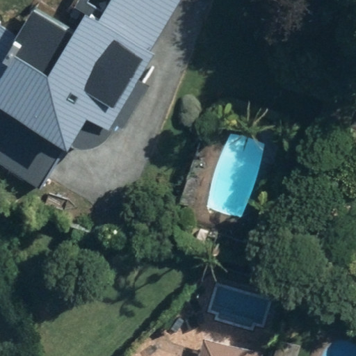
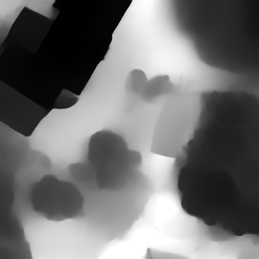

# RHM Resolution Enhancement via Depth-Guided Super-Resolution

This project enhances the resolution of Reference Height Maps (RHM) by fusing them with monocular depth estimates from aerial orthophotography using wavelet-based super-resolution.

## Overview

**Problem**: Low-resolution RHM data lacks fine-grained detail
**Solution**: Fuse RHM with high-resolution depth estimates while preserving accurate ground truth structure

**Key Insight**: Combine the best of both sources using wavelets:
- **RHM low-frequency**: Accurate coarse structure (ground truth)
- **Depth high-frequency**: Fine details (high resolution)

## Workflow

```
Aerial Imagery (512x512) ──→ Depth Estimation ──→ High-res depth maps
                                                           │
Low-res RHM ground truth ──────────────────────────────────┴──→ Wavelet Fusion ──→ Enhanced RHM
```

### Processing Steps

1. **Depth Inference**: Generate depth maps from aerial orthophotography using MiDaS or ZoeDepth
2. **Coregistration**: Align RHM to aerial image coordinates via ECC affine registration
3. **Distribution Matching**: Normalize both sources to original RHM statistics
4. **Calibration**: Linear regression for intensity consistency
5. **Wavelet Fusion**: SWT combines RHM structure with depth details

## Example Results

### Processing Pipeline

<table>
<tr>
<td align="center" colspan="3"><b>Depth Estimation Path</b></td>
</tr>
<tr>
<td align="center"><br/><i>1. Aerial Orthophotography</i></td>
<td align="center">→</td>
<td align="center"><br/><i>2. Depth Estimate (MiDaS)</i></td>
</tr>
<tr>
<td align="center" colspan="3"><b>+</b></td>
</tr>
<tr>
<td align="center" colspan="3"><b>Ground Truth RHM</b></td>
</tr>
<tr>
<td align="center" colspan="3"><br/><i>3. Low-Resolution RHM Input</i></td>
</tr>
<tr>
<td align="center" colspan="3"><b>↓ Coregistration + Distribution Matching + Wavelet Fusion</b></td>
</tr>
<tr>
<td align="center" colspan="3"><b>Enhanced Output</b></td>
</tr>
<tr>
<td align="center" colspan="3"><br/><i>4. High-Resolution Enhanced RHM</i></td>
</tr>
</table>

The enhanced RHM preserves the accurate coarse structure from the ground truth while adding fine-grained details from the depth estimation.

## Quick Start

### 1. Generate Depth Maps

```bash
python infer_depth.py img_in --model midas_large --out_dir depth_out
```

**Models**: `midas_large`, `midas_hybrid`, `midas_small`, `zoedepth_n`, `zoedepth_k`

### 2. Batch Process RHMs

```bash
python enhance_rhm.py \
  --img_dir img_in \
  --depth_dir depth_out \
  --rhm_dir rhm_reference \
  --out_dir rhm_enhanced
```

**Key Parameters**:
- `--rhm_scale 0.075`: RHM scaling factor (7.5cm/1m)
- `--wavelet db2`: Wavelet type (db2, haar, sym4)
- `--level 7`: Decomposition levels
- `--alpha 0.0`: Low-freq blend (0=all RHM, 1=all depth)
- `--gain 1.0`: High-freq detail amplification
- `--fallback_no_registration`: Process without alignment if registration fails

### 3. Explore Interactively

Open `explore.ipynb` for detailed proof-of-concept with explanations.

## Requirements

**Core**:
- PyTorch (for depth models)
- OpenCV (cv2)
- PyWavelets (pywt)
- NumPy, SciPy
- PIL/Pillow

**Batch Processing**:
- rasterio (georeferencing preservation)
- tqdm (progress tracking)

**Installation**:
```bash
pip install torch opencv-python pywavelets numpy scipy pillow rasterio tqdm
```

## Project Structure

```
depth/
├── infer_depth.py          # Depth inference script
├── enhance_rhm.py          # Batch processing script
├── explore.ipynb           # Interactive proof-of-concept notebook
├── CLAUDE.md              # Detailed documentation
├── img_in/                # Aerial orthophotography chips (512x512)
├── depth_out/             # Generated depth maps
├── rhm_reference/         # Low-resolution RHM ground truth
└── rhm_enhanced/          # Output: enhanced high-res RHMs
```

## Technical Details

**Coregistration**: Aerial imagery defines ground truth spatial location; RHM is warped to match using Enhanced Correlation Coefficient (ECC) affine registration on Gaussian-blurred and edge-detected images.

**Distribution Matching**: Z-score normalization ensures depth and RHM have consistent statistical properties (same mean/std as original RHM) before fusion.

**Wavelet Fusion**: Stationary Wavelet Transform (SWT) separates frequency bands without downsampling, allowing selective combination of RHM low-frequency structure with depth high-frequency details.

**Georeferencing**: Output GeoTIFFs preserve spatial reference from input aerial images.

## Citation

If you use this code, please reference the wavelet fusion approach and depth estimation models (MiDaS/ZoeDepth) appropriately.

## License

[Add your license here]
